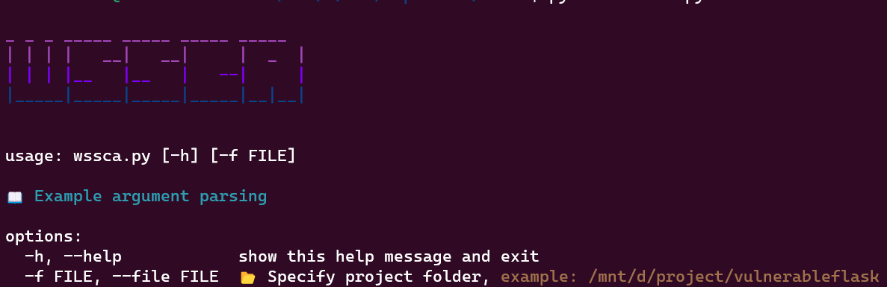
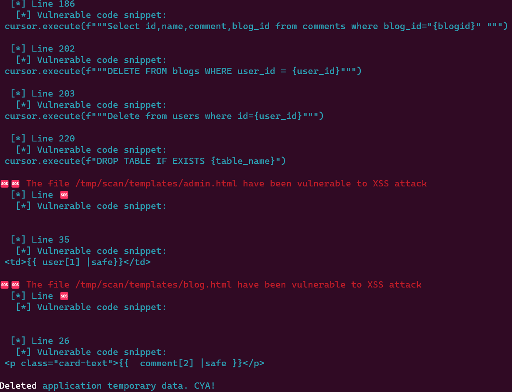
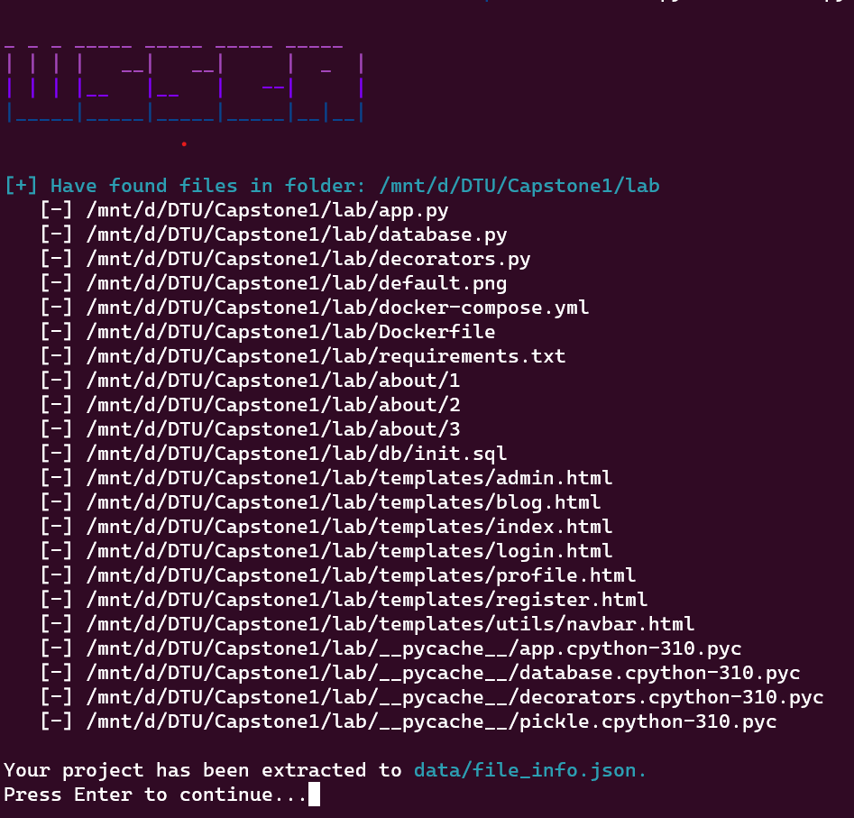
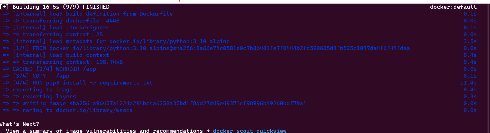
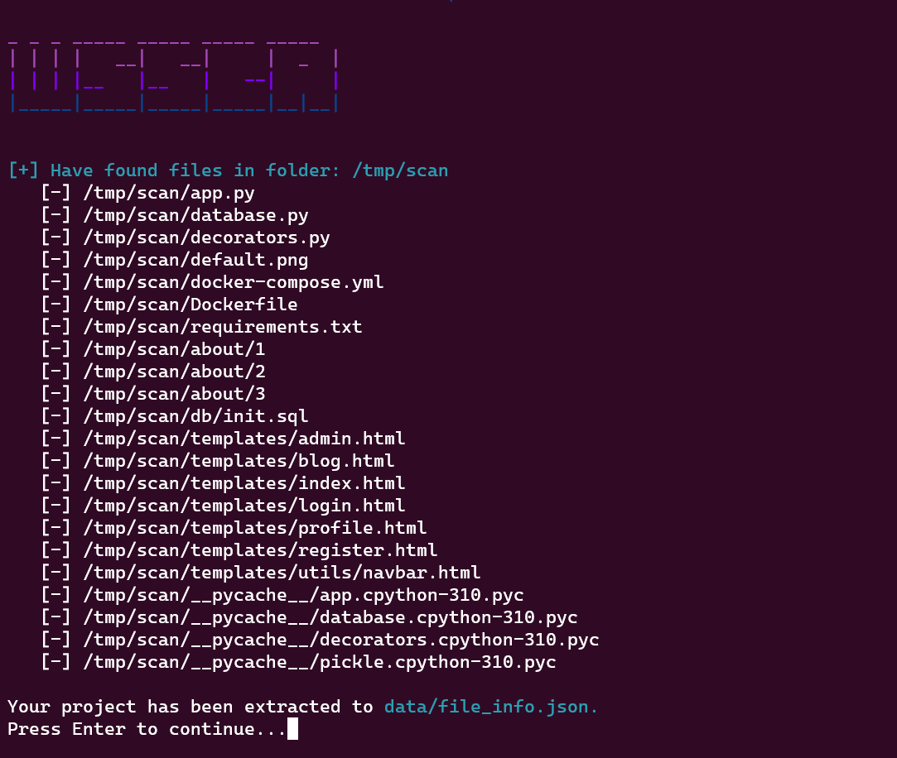

# WSSCA - Web Static Source Code Analytics :mag:



# Overview
This tool is aimed to find vulnerability in source code. Currently it is able to scan Flask project :smile:, we will try to add more language later. 

# Screenshot


# Prerequisites

## Linux
```
certifi
charset-normalizer
idna
requests
urllib3
tqdm
chardet
```
Or you can check that in the `requirements.txt` file!
```
pip3 install -R requirements.txt
```

Using `python3` to run the tool
```
python3 wssca.py --file <project_path>
```

## Docker

If you want to deploy using docker, you have to install `Docker` and `Docker Compose`

- First, you have to build the tool using `Docker` 
```
docker built -t .
```

- Secondly, run the docker image using this command
```
docker run --rm -v <project_path>:/tmp/scan -it wssca --file /tmp/scan
```


It will return the result normally as you run it on Linux


